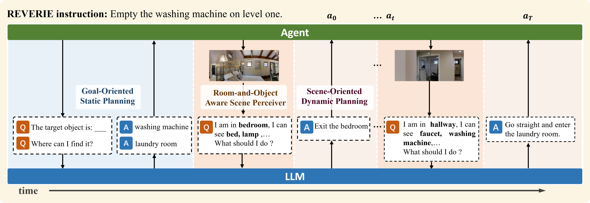

# MiC
Code of the ICCV 2023 paper :
 **March in Chat: Interactive Prompting for Remote Embodied Referring Expression** 

[[Paper](https://arxiv.org/pdf/2308.10141.pdf)] [[GitHub](https://github.com/YanyuanQiao/MiC)]

## Abstract
Many Vision-and-Language Navigation (VLN) tasks have been proposed in recent years, from room-based to object-based and indoor to outdoor. The REVERIE (Remote Embodied Referring Expression) is interesting since it only provides high-level instructions to the agent, which are closer to human commands in practice. Nevertheless, this poses more challenges than other VLN tasks since it requires agents to infer a navigation plan only based on a short instruction. Large Language Models (LLMs) show great potential in robot action planning by providing proper prompts. Still, this strategy has not been explored under the REVERIE settings. There are several new challenges. For example, the LLM should be environment-aware so that the navigation plan can be adjusted based on the current visual observation. Moreover, the LLM planned actions should be adaptable to the much larger and more complex REVERIE environment. This paper proposes a March-in-Chat (MiC) model that can talk to the LLM on the fly and plan dynamically based on a newly proposed Room-and-Object Aware Scene Perceiver (ROASP). Our MiC model outperforms the previous state-of-the-art by large margins by SPL and RGSPL metrics on the REVERIE benchmark.

Code Coming Soon!
